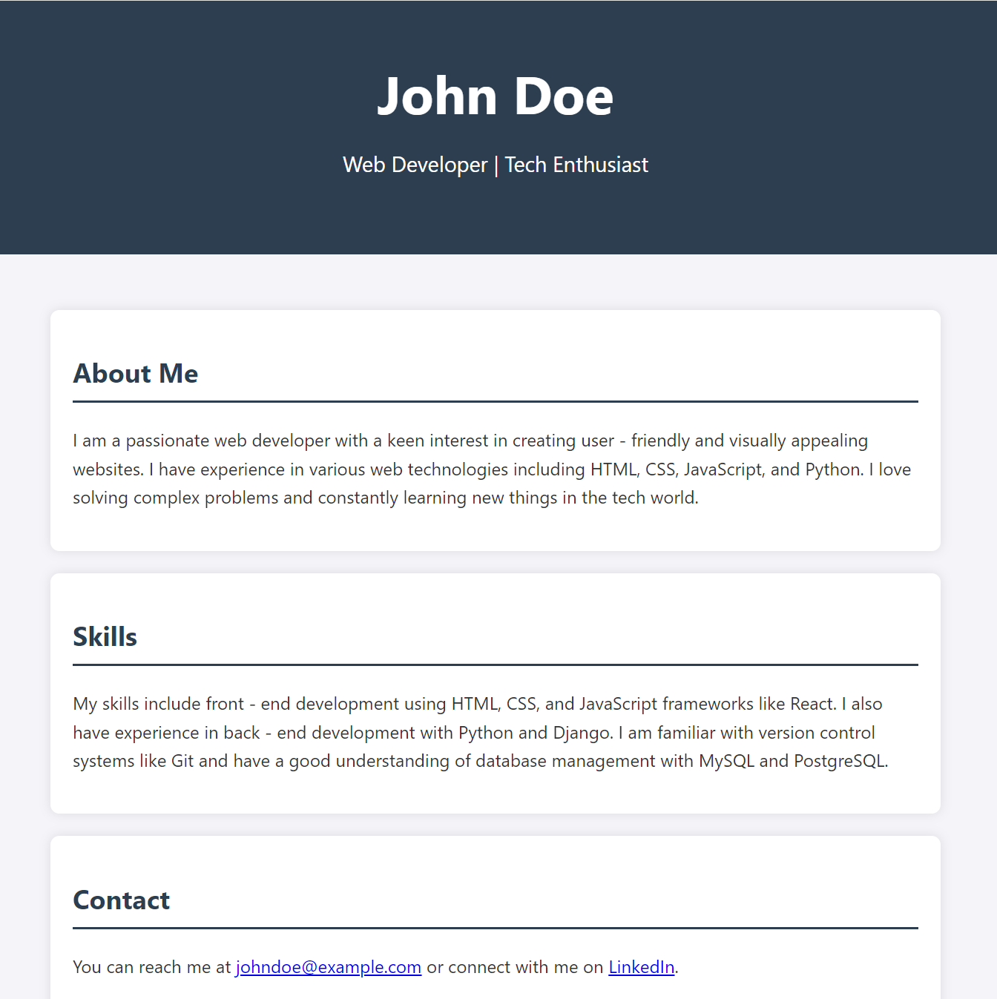
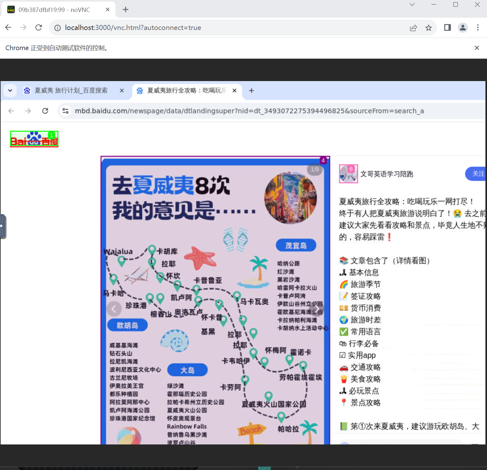

# Agent Manus Demo - For windows


English | [中文](./docs/README_zh.md)

## Update:
* 2025.03.21 : Add X11, noVNC support for native screen to Xvfb browser_use calls to AI process
* 2025.03.17 : Configure Windows executable version

### Thanks to Huiwen Information Technology Co., Ltd. and its open source project: [Agent-Manus](https://github.com/pingcy/agent-manus#)

* A multi-user intelligent agent demonstration system based on LLM for **windows**
* Able to execute code, scripts, network automation browsing and other tools in dynamically launched containers to complete input tasks.

## Results
1. After executing the "Generate a more beautiful html personal homepage" command


2. Generated html personal homepage



3. The process of browser_use calling AI as shown on the native screen.(Q: travel plans in Hawaii)

Automatically open http://localhost:3000/vnc.html?autoconnect=true and display:
<div style="display: flex; gap: 10px;">
    
    
</div>

##  Features

- Support for multi-user isolation
- Integrated code execution environment (Docker)
- Support for automated network browsing
- Intelligent code generation and execution
- Extensible tool system

## ENV

- Python 3.9+
- Docker
- OS：Windows, Other OS could refer to [Github of the Agent Manus](https://github.com/pingcy/agent-manus#)

##  Quick Start

1. Clone this repo：

```bash
git clone https://github.com/ligaoqi2/agent-manus-demo-windows.git
cd agent-manus-demo-windows
```

2. Dependencies：

```bash
pip install -r requirements.txt
```

3. Docker build：

* Config the AI model used in docker_image/build.sh

* Use gpt-4o-mini by default

```shell
# docker_image/build.sh
# line 8
OPENAI_API_KEY="Your own OpenAI API"
OPENAI_API_BASE="API URL"
```

* Build
```bash
cd docker_image
dos2unix start.sh
sh build.sh
```

4. Modify the Docker mapping path

```python
# tool_code_executor.py 
# tool_webpage_crawler.py 
BASE_WORK_DIR = "C:\\Users\\XXX\\agent-manus\\workspace\\tasks"
```

5. Modify the local AI model's api_key，base_url and model_name
```python
/* agent_main.py */
# line 29
api_key = "local model API"
base_url = "API url"
# line 52
llm = LangChainLLM(llm=ChatOpenAI(model="XXX", openai_api_key=api_key, openai_api_base=base_url))

/* tools_code_executor.py */
# line 8
api_key = "local model API"
base_url = "API url"

# line 12
def create_code_generator_tool(
        model_name: str = "XXX"
) -> FunctionTool:
```

6. Run

```bash
python agent_main.py
```

##  Instructions

1. After starting the program, enter the user ID (optional, press Enter to set the default)
2. Enter a description of the task to be performed
3. If you need to process a file, enter the file name (optional, the file should be located in the data directory under the user directory, press Enter directly by default)


##  License

MIT License

##  Acknowledgments


## Contact
```
ligaoqi02@gmail.com
```