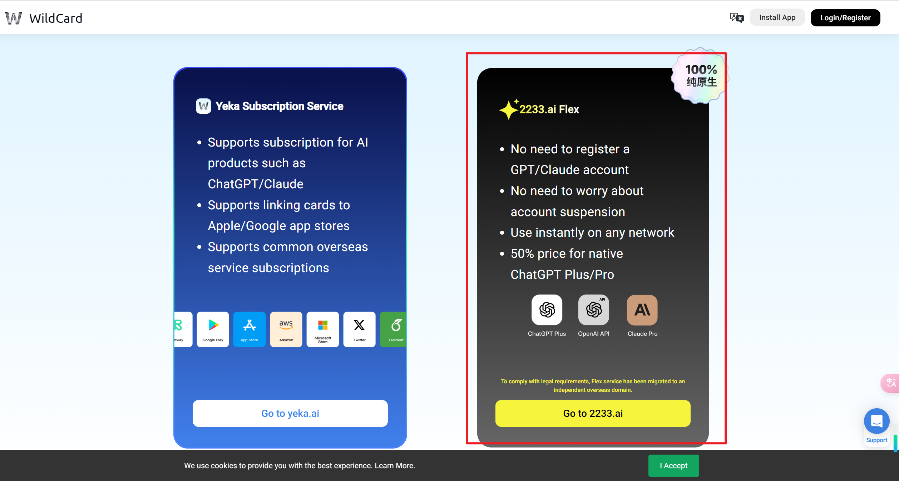

# Agent Manus Demo - windows 系统


[English](../README.md) | 中文

## 更新日志:
* 2025.03.21 更新：对 Xvfb 添加了 X11，noVNC 支持本地显示 browser_use 调用 AI的过程
* 2025.03.17 更新：配置 windows 可运行版本

### 感谢江苏慧问信息科技公司 [公众号文章](https://mp.weixin.qq.com/s/zGXMpq15xYGmWll8m1qa5w) 及其开源项目 [Agent-Manus](https://github.com/pingcy/agent-manus#)

* 一个基于LLM的多用户智能Agent演示系统，针对 **windows**
* 能够在动态启动的容器中执行代码、脚本、网络自动化浏览等工具，以完成输入任务。

## 使用效果
1. 执行 "生成一个更加美化的html个人主页" 指令后


2. 生成的html个人主页


3. 显示 browser_use 调用 AI 的过程 (问题：夏威夷的旅行计划)

自动打开http://localhost:3000/vnc.html?autoconnect=true，展示：
<div style="display: flex; gap: 10px;">
    
    
</div>

##  功能特点

-  支持多用户隔离
-  集成代码执行环境（Docker）
-  支持自动化网络浏览
-  智能代码生成与执行
-  可扩展的工具系统

## 环境要求

- Python 3.9+
- Docker
- 操作系统：Windows，其他系统可参照 [原作者Github](https://github.com/pingcy/agent-manus#)

##  快速开始

1. 克隆项目：

```bash
git clone https://github.com/ligaoqi2/agent-manus-demo-windows.git
cd agent-manus-demo-windows
```

2. 安装依赖：

```bash
pip install -r requirements.txt
```

3. 构建Docker镜像：

在 docker_image/build.sh 中设置镜像所用的 AI 模型

个人所用为 gpt-4o-mini

没有海外账户，可以 [wildcard](https://bewildcard.com/service) 里的 zfb 买一个


```shell
# docker_image/build.sh
# line 8
OPENAI_API_KEY="自己的 API"
OPENAI_API_BASE="API 对应链接"
```

执行构建
```bash
cd docker_image
dos2unix start.sh     # windows到 linux 中的 sh文件 回车需要转换
sh build.sh
```

[国内docker镜像](https://zhuanlan.zhihu.com/p/28662850275)配置
```json
{
    "registry-mirrors": [
    "https://docker.m.daocloud.io",
    "https://docker.imgdb.de",
    "https://docker-0.unsee.tech",
    "https://docker.hlmirror.com",
    "https://cjie.eu.org"
    ]
}
```
个人采用 docker desktop，配置如下


4. 修改 docker 映射路径
修改 tool_code_executor.py 与 tool_webpage_crawler.py 中的 本地工作目录 BASE_WORK_DIR 为自己 windows 中的目录
```python
BASE_WORK_DIR = "C:\\Users\\XXX\\agent-manus\\workspace\\tasks"
```
CONTAINER_DIR 是映射到容器内的路径，与 BASE_WORK_DIR 内容相同，可不修改

5. 修改本地模型的 api_key，base_url 还有 model_name
```python
/* agent_main.py */
# line 29
api_key = "本地模型 API"
base_url = "API 链接"
# line 52
llm = LangChainLLM(llm=ChatOpenAI(model="模型名XXX", openai_api_key=api_key, openai_api_base=base_url))

/* tools_code_executor.py */
# line 8
api_key = "本地模型 API"
base_url = "API 链接"

# line 12
def create_code_generator_tool(
        model_name: str = "模型名XXX"
) -> FunctionTool:
```

6. 运行程序：

```bash
python agent_main.py
```

##  使用说明

1. 启动程序后输入用户ID（可选，直接回车默认为default）
2. 输入要执行的任务描述
3. 如需处理文件，输入文件名（可选，文件应位于用户目录下的data目录下，直接回车默认无）


##  许可证

MIT License

##  致谢


## 欢迎探讨
```
ligaoqi02@gmail.com
```